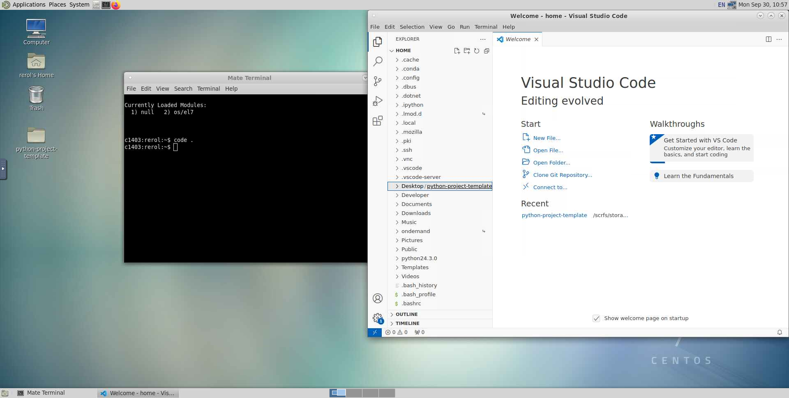

# Linux 101: Hands-On Training

In this training, we are going to learn the basics of how to use a linux based operating system (OS) operations using command environment, terminal in an HPC system. We will learn how to create a file, move folder to another folder, download a file from internet, and more. Alright, let's get started.
 

In this hands-on session, you will learn what terminal is, why we need it, and how it is different from other operating systems, and importance of terminal for the Linux-based OS. You can think terminal as a kind of interface between the user and the operating system's brain.
 

Many HPC users like to develop projects in HPC environment. To help new users to get used to this habit, we will build a project template together so you'll learn how to organize files/folder for your project in the HPC system.

If everyone is ready to start, let's get started!

Make sure to open the interactive GUI desktop application and then open a terminal session from the toolbar. Then, follow the instructions below.

-----

Since terminal shows us where we are, we like to see the full path with:

	$ pwd

Change directory to where you want to create your project template:

	$ cd /home/rerol/Desktop
 	
Create the project folder:

	$ mkdir python-project-template

List the directory to see if we actually created the folder ???

	$ ls

Great! The project folder was created successfully! 

The next step is creating each required files and folders for the project template.

	# Check if we are in the correct directory ???
	$ pwd

	# Yes, we are still in the correct directory!
	# Let's continue completing the tasks

	$ touch main.py
	$ touch requirements.txt
	$ mkdir data
	$ mkdir output

	# Now, we have enough files and folders to start project development.

Great! Now, let's check if we created all the files and folders for the project template???

	$ ls --group-directories-first
	$ ls --g

    ├── data
    ├── output
    ├── main.py
    └── requirements.txt

It looks like we have the most of the files and folders needed to start development. Next step is filling in these files and folders.

------

In this part of the training, we'll build a mini Python project and run it on the HPC system. Before going further, let's get to know what the project will be about. To make things simple and more understandable, fibonacci sequence is used for the core of the project. Basically, we'll calculate some set of fibonacci values, and we'll display their sequential ratios in a plot. If there is no question, let's get our hands dirty!

		$ code .  
		# In the VM GUI, this command opens the Visual Studio Editor.

Now, we are in the editor. Let's continue writing some code.

		...

It looks like writing code in the training is going to take more than I anticipated. Let's clone the repo and continue working on there!

		$ git clone erolrecep/python-project-template-full.git

Since the name of the repository is different than we created, you can easily clone the repository to the same directory of "/home/<username>/Desktop/python-project-template".
 

To make sure the cloned repository is correctly cloned, let's check it.

		$ pwd 			# /home/<username>/Desktop/python-project-template
		$ cd .. 		# This command changes the directory to the parent directory
		$ cd python-project-template-full
		# Now, we are in the repository folder

Let's prepare Python environment for the project:

    $ module load miniforge

Make sure we have access to Python REPL:

    $ python3
    >>>

The next step is to load other required software:

    $ module load 
    $ activate conda environment

Now, run the project:

    $ pwd
    # ../python-project-template-full
    
    $ ls
    ├── data
    ├── output
    ├── main.py          <------
    └── requirements.txt

Python file, "main.py" will be used to run the project.

    $ python main.py

The output of  the program is written to the "output" folder!

## Exercise!

Can you make this project run with SLURM in HPC?

After, tomorrow's training, you can easily write the slurm job script and submit for running the project.

Awesome! You learned a lot today!
